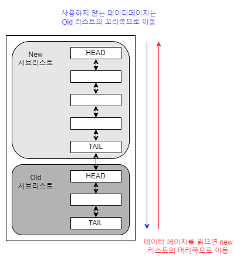

# InnoDB 스토리지 엔진 - 버퍼풀

### 버퍼풀

<mark style="background-color:blue;">디스크의 데이터 파일이나 인덱스 정보를 메모리에 캐시해두는 공간이다. 쓰기 작업을 지연시켜 일괄 작업으로 처리할 수 있게 해주는 버퍼 역할도 같이 수행한다</mark>. INSERT, UPDATE, DELETE 처럼 데이터를 변경하는 쿼리는 데이터 파일의 이곳저곳에 위치한 레코드를 변경하기 때문에 랜덤한 디스크 작업을 발생시키는데 <mark style="background-color:blue;">버퍼풀이 이러한 변경된 데이터를 모아서 처리하면 랜덤한 디스크 작업의 횟수를 줄일 수 있는 장점이 있다.</mark>

#### 버퍼풀 구조

<mark style="background-color:blue;">InnoDB 스토리지 엔진은 버퍼 풀이라는 거대한 메모리 공간을 페이지 크기의 조각으로 쪼개어 InnoDB 스토리지 엔진이 데이터를 필요로 할 때 해당 데이터 페이지를 읽어서 각 조각에 저장한다.</mark> 버퍼 풀의 크기 조각을 관리하기 위해 InnoDB 스토리지 엔진은 크게 <mark style="background-color:blue;">LRU(Least Recently Used) 리스트</mark>와 플러시 리스트, 프리 리스트 자료구조를 사용한다.&#x20;

<figure><figcaption>
버퍼 풀 관리를 위한 LRU 리스트 구조
</figcaption></figure>

<mark style="background-color:blue;">LRU 리스트를 관리하는 목적은 디스크로부터 한 번 읽어온 페이지를 최대한 오랫동안 InnoDB 버퍼풀의 메모리에 유지해서 디스크 읽기를 최소화하는 것이다</mark>. 다음은 InnoDB 스토리지 엔진에서 데이터를 찾는 과정이다.

1. 필요한 레코드가 저장된 데이터 페이지가 버퍼 풀에 있는지 검사
2. 디스크에서 필요한 데이터 페이지를 버퍼 풀에 적재하고, 적재된 페이지에 대한 포인터를 LRU 헤더 부분에 추가
3. 버퍼 풀의 LRU 헤더 부분에 적재된 데이터 페이지가 실제로 읽히면 MRU 헤더 부분으로 이동
4. 버퍼 풀에 상주하는 데이터 페이지를 사용자 쿼리가 얼마나 최근에 접근했었는지에 따라 나이(Age)가 부여되며, 버퍼 풀에 상주하는 동안 쿼리에서 오랫동안 사용되지 않으면 데이터 페이지에 부여된 나이가 오래되면서 해당 페이지는 버퍼풀에서 제거된다. 버퍼 풀의 데이터 페이지가 쿼리에 의해 사용되면 나이가 초기화되어 다시 젊어지고 MRU 헤더 부분으로 옮겨진다.
5. 필요한 데이터가 자주 접근됐다면 해당 페이지의 인덱스 키를 어댑티브 해시 인덱스에 추가

<mark style="background-color:blue;">플러시 리스트는 디스크로 동기화되지 않은 데이터를 가진 데이터 페이지의 변경 시점 기준의 페이지 목록을 관리한다. 디스크에서 읽은 상태 그대로 전혀 변경이 없었다면 플러시 리스트에 관리되지 않지만, 일단 한 번 데이터 변경이 가해진 데이터 페이지는 플러시 리스트에 관리되고 특정 시점이 되면 디스크로 기록돼야 한다.</mark> \
\
데이터가 변경되면 InnoDB는 변경 내용을 리두 로그에 기록하고 버퍼 풀의 데이터 페이지에도 변경 내용을 반영한다.&#x20;

