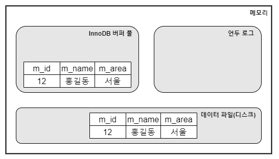
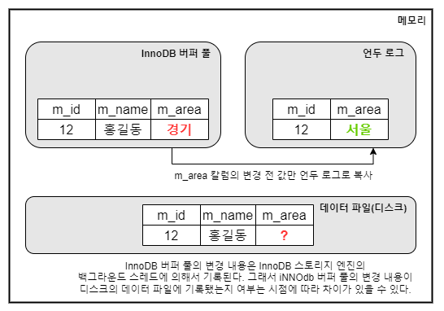

# InnoDB 스토리지 엔진


### InnoDB 스토리지 엔진

InnoDB 스토리지 엔진은 레코드 기반의 잠금을 제공하여 높은 동시성 처리가 가능한 엔진이다.

<figure><figcaption></figcaption></figure>

#### 프라이머리 키를 기준으로 클러스터링

<mark style="background-color:blue;">InnoDB 엔진은 프라이머리 키 값의 순서대로 디스크에 저장</mark>되고 모든 세컨더리 인덱스는 레코드의 주소 대신 프라이머리 키의 값을 논리적인 주소로 사용한다. 프라이머리 키가 클러스터링 인덱스이기 때문에 프라이머리 키를 이용한 레이지 스캔은 상당히 빠르게 처리할 수 있다.\
\
<mark style="background-color:blue;">MyISAM 스토리지 엔진에서는 클러스터링 키를 지원하지 않는다</mark>. 그래서 MyISAM 테이블에서는 프라이머리 키와 세컨더리 인덱스는 구조적으로 아무런 차이가 없고 프라이머리 키는 유니크 제약을 가진 세컨더리 인덱스와 동일하다.


#### 외래 키 지원

<mark style="background-color:blue;">외래 키는 InnoDB 스토리지 엔진에서 지원하는 기능으로 MyISAM 이나 MEMORY 테이블에서는 사용할 수 없다</mark>. 외래 키는 부모 테이블과 자식 테이블 모두 해당 칼럼에 인덱스 생성이 필요하고, 변경 시에는 반드시 부모 테이블이나 자식 테이블에 데이터가 있는지 체크하는 작업이 필요하므로 <mark style="background-color:blue;">잠금이 여러 테이블로 전파될 수 있기 때문에 주의가 필요하다.</mark>


#### MVCC

<mark style="background-color:blue;">InnoDB는 하나의 레코드에 대해 여러 개의 버전을 관리함으로써 레코드 레벨의 트랜잭션과 잠금을 사용하지 않는 일관적 읽기를 제공한다.</mark> 아래 이미지는 member 테이블을 생성하고 데이터를 INSERT 했을 때 메모리의 적재된 데이터 예시이다. &#x20;

```sql
INSERT INTO member (m_id, m_name, m_area) VALUES (12, '홍길동', '서울');
COMMIT;
```

<div align="left">

<figure><figcaption></figcaption></figure>

</div>

이 상태에서 만약 업데이트 쿼리를 실행하면 어떻게 될까?&#x20;

```sql
UPDATE member SET m_area="경기" WHERE m_id=12;
```

<div align="left">

<figure><figcaption></figcaption></figure>

</div>

<mark style="background-color:blue;">UPDATE 문장이 실행되면 커밋 실행 여부와 관계없이 InnoDB의 버퍼 풀은 새로운 값인 '경기'로 업데이트된다. 그리고 디스크의 데이터 파일에는 백그라운드 스레드에 의해 새로운 값으로 업데이트 됐을 수도 있고 아닐 수도 있다(ACID 는 보장함)</mark>. 아직 COMMIT 이나 ROLLBACK이 되지 않은 상태에서 다른 사용자가 다음 같은 쿼리로 작업 중인 레코드를 조회하면 어디에 있는 데이터를 조회할까?

```sql
SELECT * FROM member WHERE m_id=12;
```

답은 <mark style="background-color:blue;">MySQL 서버의 시스템 변수(transaction\_isolation)에 설정된 격리 수준에 따라 다르다는 것이다</mark>. 격리 수준이 READ\_UNCOMMITTED 인 경우에는 INNODB 버퍼 풀이 현재 가지고 있는 데이터(경기)를 읽어서 작업 완료 여부와 상관없이 반환한다. 그렇지 않고 READ\_COMMIT 이나 그 이상의 격리 수준(REPEATABLE\_READ, SERIALIZABLE) 인 경우 아직 커밋되지 않았기 때문에 InnoDB 버퍼 풀이나 데이터 파일에 있는 내용 대신 변경되기 이전의 내용을 보관하고 있는 언두 영역의 데이터를 반환한다.&#x20;

위와 같이 하나의 레코드에 여러 개의 버전을 가지고 관리하는 것이 MVCC 이다. 위 예시에서는 1개의 버전만 관리하고 있지만 <mark style="background-color:orange;">관리해야 하는 예전 버전(언두 영역)이 무한히 많아질 수 있다. 때문에 트랜잭션이 길어지면 예전 데이터가 삭제되지 못하고 오랫동안 관리되어야 하기 때문에 시스템 장애의 원인이 될 수 있기 때문에 주의가 필요하다.</mark>  &#x20;

그리고 언두 영역의 데이터는 한 트랜잭션에서 COMMIT을 하더라도 즉시 삭제되는 것은 아니고 이 언두 영역을 필요로 하는 트랜잭션이 더는 없을 때 삭제된다.


#### 잠금 없는 일관된 읽기

<mark style="background-color:blue;">InnoDB 스토리지 엔진은 MVCC 기술을 이용해 잠금을 걸지 않고 읽기 작업을 수행한다. 잠금을 걸지 않기 때문에 InnoDB 에서 읽기 작업은 다른 트랜잭션이 가지고 있는 잠금을 기다리지 않고, 읽기 작업이 가능하다</mark>. 격리 수준이 SERIALIZABLE이 아닌 READ\_UNCOMMITTED나 READ\_COMMITTED, REPEATABLE\_READ 수준인 경우 <mark style="background-color:orange;">INSERT와 연결되지 않은 순수한 읽기 작업은 다른 트랜잭션의 변경 작업과 관계없이 항상 잠금을 대기하지 않고 바로 실행된다.</mark>&#x20;

* 베타락(SELECT \~ FOR UPDATE)과의 관계: 베타락은 레코드에 LOCK 잠금을 거는것이고 MVCC 는 잠금 없이 일관되게 읽을 수 있는 기능인 것이다. 레코드에 베타락을 걸게되면 MVCC 기능이 있더라도 락을 얻을 때까지 레코드를 읽을 수 없다.


####


