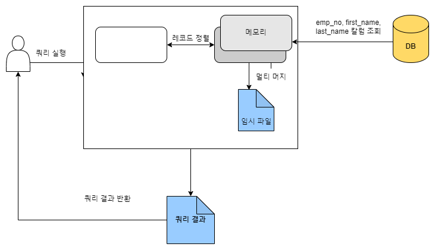
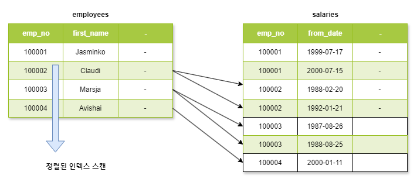

# ORDER BY

<table><thead><tr><th width="150"> </th><th>장점</th><th>단점</th><th data-hidden></th></tr></thead><tbody><tr><td>인덱스 이용</td><td><ul><li>인덱스는 정렬된 상태를 유지하기 때문에 정렬 처리가 매우 빠르다</li></ul></td><td><ul><li>DML 수행 시 부가적인 인덱스 추가/삭제 작업이 필요하다</li><li>인덱스로 인해 디스크 공간이 더 필요하다</li></ul></td><td></td></tr><tr><td>Filesort 이용</td><td><ul><li>인덱스의 단점이 장점</li></ul></td><td><ul><li>레코드 대상 건수가 많아질수록 쿼리의 응답 속도가 느리다.</li></ul></td><td></td></tr></tbody></table>

<mark style="background-color:blue;">인덱스를 이용하면 빠른 정렬 처리가 가능하지만 다음과 같은 사유로 모든 정렬을 인덱스로 처리하기는 어려움이 있다.</mark> 인덱스를 이용하지 않고 별도의 정렬 처리를 수행했는지는 실행 계획의 Extra 칼럼에 "Using filesort" 메세지가 표시되는지 여부로 판단할 수 있다.

* 정렬 기준이 너무 많아서 요건별로 모두 인덱스를 생성하는 것이 불가능한 경우
* GROUP BY 결과 또는 DISTINCT 같은 처리의 결과를 정렬해야 하는 경우
* UINION의 결과와 같이 임시 테이블의 결과를 다시 정렬해야 하는 경우
* 랜덤하게 결과 레코드를 가져와야 하는 경우


### 소트 버퍼

<mark style="background-color:blue;">MySQL은 정렬을 수행하기 위해 별도의 메모리 공간을 할당받아서 사용하는데, 이 메모리 공간을 소트 버퍼라고 한다.</mark> 소트 버퍼는 정렬이 필요한 경우에만 할당되며 쿼리 실행이 완료되면 즉시 시스템으로 반납된다.\
\
<mark style="background-color:blue;">만약 정렬해야 할 레코드의 건수가 소트 버퍼로 할당된 공간보다 크다면 어떻게 동작할까? 이러한 경우 MySQL은 정렬해야 할 레코드를 여러 조각으로 나눠서 처리하는데, 이 과정에서 임시 저장을 위해 디스크를 사용한다.</mark>\
\
MySQL은 글로벌 메모리 영역과 세션 메모리 영역으로 나눠서 생각할 수 있는데 소트 버퍼는 세션 메모리 영역에 해당한다. 때문에 커넥션이 많으면 많을수록, 정렬 작업이 많으면 많을수록 소트 버퍼로 소비되는 ㅁ메모리 공간이 커짐을 의미한다. 때문에 소트 버퍼를 너무 크게 설정(10MB ↑) 메모리 부족 현상을 겪을 수 있다.


### 정렬 알고리즘

레코드를 정렬할 때 레코드 전체를 소트 버퍼에 담을지 또는 정렬 기준 칼럼만 소트 버퍼에 담을지에 따라 "싱글 패스" 와 "투 패스" 2가지 정렬 모드로 나눌 수 있다.&#x20;

#### 싱글 패스 정렬 방식

<mark style="background-color:blue;">소트 버퍼에 정렬 기준 칼럼을 포함해 SELECT 대상이 되는 칼럼 전부를 담아서 정렬을 수행하는 정렬 방식이다.</mark>

```sql
SELECT emp_no, first_name, last_name FROM employees ORDER BY first_name;
```

위 쿼리와 같이 first\_name 으로 정렬해서 emp\_no, first\_name, last\_name을 SELECT 하는 쿼리를 "싱글 패스 정렬 방식"으로 처리하는 절차는 다음과 같다. 그림에서 알 수 있듯이, 처음 employees 테이블을 읽을 때 정렬에 필요하지 않은 last\_nname 칼럼까지 전부 읽어서 소트 버퍼에 담고 정렬을 수행한다.

<div align="left">

<figure><figcaption></figcaption></figure>

</div>

#### 투 패스 정렬 방식

<mark style="background-color:blue;">정렬 대상 칼럼과 프라이머리 키 값만 소트 버퍼에 담아서 정렬을 수행하고, 정렬된 순서대로 다시 프라이머리 키로 테이블을 읽어서 SELECT 할 칼럼을 가져오는 정렬 방식이다.</mark> 아래 그림을 보면 employees 테이블을 읽을 때는 정렬에 필요한 first\_name 칼럼과 프라이머리 키인 emp\_no 만 읽어서 정렬을 수행했음을 알 수 있다. 이 정렬이 완료되면 그 결과 순서대로 employees 테이블을 한번 더 읽어서 last\_name을 가져오고, 최종적으로 그 결과를 클라이언트 쪽으로 넘기는 과정을 확인할 수 있다.

<div align="left">

<figure><figcaption></figcaption></figure>

</div>

#### 싱글 패스 정렬 방식 vs 투 패스 정렬 방식

MySQL 의 예전 정렬 방식인 투 패스 방식은 테이블을 두 번 읽어야 하기 때문에 상당히 불합리하지만, 새로운 정렬 방식인 싱글 패스는 이러한 불합리가 없다. 하지만 싱글 패스 정렬 방식은 더 많은 소트 버퍼 공간이 필요하다. \
\
<mark style="background-color:blue;">싱글 패스 방식은 정렬 대상 레코드의 크기나 건수가 작은 경우 빠른 성능을 보이며, 투 패스 방식은 정렬 대상 레코드의 크기나 건수가 상당히 많은 경우 효율적이다.</mark>


### 정렬 처리 방법

쿼리에 ORDER BY 가 사용되면 반드시 다음 3가지 처리 방법 중 하나로 정렬이 처리된다. 일반적으로 아래쪽에 있는 정렬 방법으로 갈수록 처리 속도는 떨어진다.

<table><thead><tr><th>정렬 처리 방법</th><th>실행 계획의 Extra 칼럼 내용</th><th data-hidden></th></tr></thead><tbody><tr><td>인덱스를 사용한 정렬</td><td>별도 표기 없음</td><td></td></tr><tr><td>조인에서 드라이빙 테이블만 정렬</td><td>"Using filesort" 메세지가 표시됨</td><td></td></tr><tr><td>조인에서 조인 결과를 임시 테이블로 저장 후 정렬</td><td>"Using temporary; Using filesort" 메세지가 표시됨</td><td></td></tr></tbody></table>

<mark style="background-color:blue;">옵티마이저는 정렬 처리를 위해 인덱스를 이용할 수 있을지 검토할 것이다</mark>. <mark style="background-color:blue;">인덱스를 이용할 수 있다면 별도의 "Filesort" 과정 없이 인덱스를 순서대로 읽어서 결과를 반환한다. 하지만 인덱스를 사용할 수 없다면 WHERE 조건에 일치하는 레코드를 검색해 정렬 버퍼에 저장하면서 정렬을 처리할 것이다.</mark> 이 때 MySQL 옵티마이저는 정렬 대상 레코드를 최소화하기 위해 다음 2가지 방법 중 하나를 선택한다.

* 조인의 드라이빙 테이블만 정렬한 다음 조인을 수행 (더 효율적)
* 조인이 끝나고 일치하는 레코드를 모두 가져온 후 정렬을 수행

#### 인덱스를 사용한 정렬

<mark style="background-color:blue;">인덱스를 이용한 정렬을 위해서는 반드시 ORDER BY에 명시된 칼럼이 제일 먼저 읽는 테이블(조인이 사용된 경우 드라이빙 테이블)에 속하고, ORDER BY 순서대로 생성된 인덱스가 있어야 한다. 또한 WHERE 절에 첫 번째로 읽는 테이블의 칼럼에 대한 조건이 있다면 그 조건과 ORDER BY 는 같은 인덱스를 사용할 수 있어야 한다.</mark>\
\
인덱스를 이용해 정렬이 처리되는 경우에는 실제 인덱스의 값이 정렬돼 있기 때문에 인덱스의 순서대로 읽기만 하면 된다. <mark style="background-color:blue;">다음 쿼리는 ORDER BY 있든 없든 같은 인덱스를 레인지 스캔해서 나온 결과는 같은 순서로 출력된다.</mark>&#x20;

```sql
SELECT * 
FROM employees e, salaries s 
WHERE s.emp_no = e.emp_no 
    AND e.emp_no BETWEEN 100002 AND 100020 
ORDER BY e.emp_no;

SELECT *
FROM employees e, salaries s
WHERE s.emp_no = e.emp_no
    AND e.emp_no BETWEEN 100002 AND 100020
```

<mark style="background-color:blue;">ORDER BY 절이 없어도 정렬이 되는 이유는 아래 그림과 같이 employees 테이블의 프라이머리 키를 읽고, 그 다음으로 salaries 테이블을 조인했기 때문이다</mark>. 조인이 네스티드-루프 방식으로 실행되기 때문에 조인 때문에 드라이빙 테이블의 인덱스 읽기 순서가 흐트러지지 않는다. <mark style="background-color:orange;">하지만 조인이 사용된 쿼리의 실행 계획에 조인 버퍼(Join Buffer)가 사용되면 순서가 흐트러질 수 있기 때문에 주의해야 한다.</mark>

<div align="left">

<figure><figcaption></figcaption></figure>

</div>
