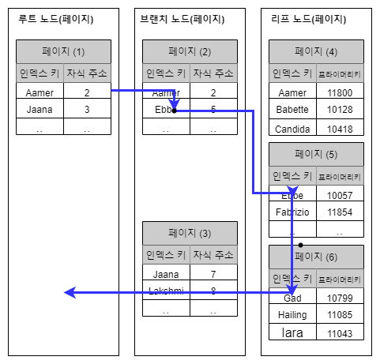
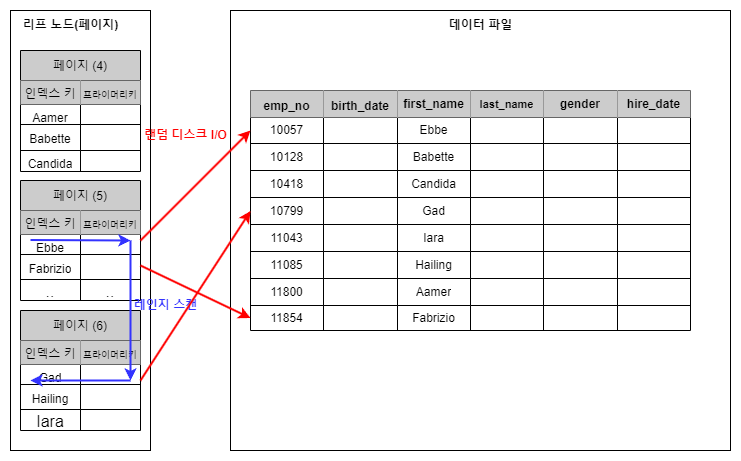
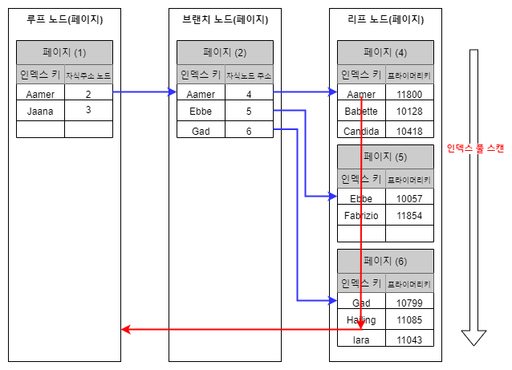
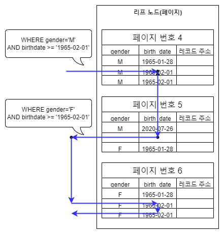

# B-Tree 인덱스를 통한 데이터 읽기

### 인덱스 레인지 스캔

인덱스 레인지 스캔은 인덱스의 접근 방법 가운데 가장 대표적인 방법으로 검색해야 할 인덱스의 범위가 결정됐을 때 사용하는 방식이다.&#x20;

```sql
SELECT * FROM employees WHERE first_name BETWEEN 'Ebbe' AND 'Gad';
```

<div align="left">

<figure><figcaption></figcaption></figure>

</div>

<mark style="background-color:blue;">인덱스 레인지 스캔은 B-Tree 인덱스에서 루트와 브랜치 노드를 이용해 스캔 시작 위치를 검색하고, 그 지점부터 필요한 방향으로 인덱스를 읽어 나가는 방식으로 동작한다. 중요한 것은 해당 인덱스를 구성하는 칼럼의 정순 또는 역순으로 정렬된 상태로 레코드를 가져온다.</mark> (이미 정렬된 상태이기 때문에)\
\
또한 아래와 같이 <mark style="background-color:blue;">리프 노드에서 검색 조건에 일치하는 건들은 데이터 파일에서 레코드를 읽어오는 과정이 필요하다. 이 때 레코드 1건 단위로 랜덤 디스크 I/O 가 발생하기 때문에 인덱스를 통해 데이터를 읽는 것이 높은 비용이 든다</mark>는 것이다.

<figure><figcaption></figcaption></figure>

#### 인덱스 레인지 스캔의 동작 단계

1. 인덱스에서 조건을 만족하는 값이 저장된 위치를 찾는다 (인덱스 탐색)
2. 1번에서 탐색된 위치부터 필요한 만큼 인덱스를 차례대로 쭉 읽는다. (인덱스 스캔)
3. 2번에서 읽어들인 인덱스 키와 레코드 주소를 이용해 레코드가 저장된 페이지를 가져오고, 최종 레코드를 읽는다.

#### 커버링 인덱스

쿼리가 필요로 하는 데이터에 따라 데이터 파일을 탐색하는 과정이 필요하지 않을 수 있는데 이를 커버링 인덱스라고 한다.&#x20;


### 인덱스 풀 스캔

<mark style="background-color:blue;">인덱스 레인지 스캔과 달리 인덱스의 처음부터 끝까지 모두 읽는 방식을 인덱스 풀 스캔이라고 한다.</mark> 대표적으로 쿼리의 조건절에 사용된 칼럼이 인덱스의 첫 번째 칼럼이 아닌 경우 인덱스 풀 스캔 방식이 사용된다. 예를 들어, 인덱스는 (A, B, C) 칼럼의 순서로 만들어져 있지만 쿼리의 조건절은 B칼럼이나 C칼럼으로 검색하는 경우다. \
\
<mark style="background-color:blue;">쿼리가 인덱스에 명시된 칼럼만으로  조건을 처리할 수 있는 경우에 주로 사용되며 인덱스 뿐만 아니라 데이터 레코드까지 모두 읽어야  한다면 절대 이 방식으로 처리되지 않는다.</mark> 이 방식은 인덱스 레인지 스캔보다는 빠르지 않지만 테이블 풀 스캔보다는 효율적이다.

<div align="left">

<figure><figcaption></figcaption></figure>

</div>

### 루스 인덱스 스캔

<mark style="background-color:blue;">루스 인덱스 스캔은 인덱스 레인지 스캔과 비슷하게 작동하지만 중간에 필요치 않은 인덱스 키 값은 무시하고 다음으로 넘어가는 형태로 처리한다.</mark> 일반적으로 GROUP BY 또는 집합 함수 가운데 MAX() 또는 MIN() 함수에 대해 최적화를 하는 경우에 사용된다.

```sql
SELECT dept_no, MIN(emp_no) 
FROM dept_emp
WHERE dep_no BETWEEN 'd002' AND 'd004'
GROUP BY dept_no;
```

위 쿼리에서 사용된 dept\_emp 테이블에는 (dept\_no, emp\_no) 조합으로 인덱스가 생성되어 있다고 해보자. 그렇다면 인덱스는 모두 정렬된 상태이기 때문에 dep\_no 그룹에서 첫 번째 레코드의 emp\_no 만 읽으면 되기 때문에 나머지 레코드는 건너뛰면서 성능을 향상 시키도록 동작한다.


### 인덱스 스킵 스캔

<mark style="background-color:blue;">인덱스의 핵심은 값이 정렬돼 있다는 것이며, 이로 인해 인덱스를 구성하는 칼럼의 순서가 매우 중요하다.</mark> 예를 들어 다음과 같은 인덱스가 있다고 가정해보자.

```sql
ALTER TABLE employees
    ADD INDEX ix_gender_birthdate (gender, birth_date);
```

\
<mark style="background-color:blue;">이 인덱스를 사용하려면 WHERE 조건절에 gender 칼럼에 대한 비교가 필수로 들어가야만 했다.</mark> 하지만 MySQL 8.0 버전부터는 <mark style="background-color:blue;">옵티마이저가 gender 칼럼을 건너뛰어서 birth\_date 칼럼만으로 인덱스 검색이 가능하게 해주는 인덱스 스킵 스캔 최적화 기능이 도입되었다.</mark>

```sql
// 인덱스를 사용하지 못하는 쿼리
SELECT * FROM employees WHERE birth_date >='1965-02-01';

// 인덱스를 사용할 수 있는 쿼리
SELECT * FROM employees WHERE gende='M' AND birth_date >='1965-02-01';
```

<mark style="background-color:blue;">인덱스 스킵 스캔의 동작 방식에 대해 알아보자. MySQL 옵티마이저는 우선 gender 칼럼에서 유니크한 값을 모두 조회해서 주어진 쿼리에 gender 칼럼의 조건을 추가해서 쿼리를 다시 실행하는 형태로 처리한다.</mark>

<div align="left">

<figure><figcaption></figcaption></figure>

</div>

인덱스 스킵 스캔은 다음과 같은 단점이 있다.

1. WHERE 조건 절에 조건이 없는 인덱스의 선행 칼럼의 유니크한 값의 개수가 적어야 한다.
2. 쿼리가 인덱스에 존재하는 칼럼만으로 처리가 가능해야 인덱스 스킵 스캔을 사용할 수 있다.
