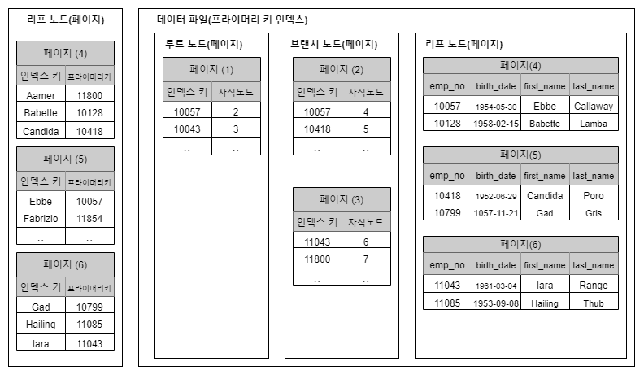

# B-Tree 인덱스

### B-Tree 인덱스

칼럼의 원래 값을 변형시키지 않고 인덱스 구조체 내에서는 항상 정렬된 상태로 유지한다. 전문 검색과 같은 특수한 요건이 아닌 경우, 대부분 인덱스는 거의 B-Tree를 사용할 정도로 일반적인 용도에 적합한 알고리즘이다.&#x20;

#### 구조 및 특성

B-Tree 인덱스는 루트 노드(최상위), 브랜치 노드(중간), 리프 노드(최하위)로 구성되어 있다. 데이터베이스에서 인덱스와 실제 데이터가 저장된 데이터는 따로 관리되는데, 인덱스의 리프 노드는 항상 실제 데이터 레코드를 찾아가기 위한 주솟값을 가지고 있다.&#x20;

<figure><figcaption></figcaption></figure>

대부분의 DBMS 에서는인덱스의 키 값은 모두 정렬돼 있지만, 데이터 파일의 레코드는 정렬돼 있지 않고 임의의 순서로 저장돼 있다. 하지만 InnoDB 테이블에서는 위의 그림과 같이 클러스터되어 저장되므로기본적으로 프라이머리 키 순서대로 디스크에 저장된다.\
\

<figure><figcaption></figcaption></figure>

위의 이미지는 테이블의 인덱스와 데이터 파일의 관계를 보여주고 있다. InnoDB 테이블에서 인덱스를 통해 레코드를 읽을 때는 데이터 파일을 바로 찾아가지 못한다. 인덱스에 저장돼 있는 프라이머리 키 값을 이용해 프라이머리 키 인덱스를 한번 더 검색한 후, 프라이머리 키 인덱스의 리프 페이지에 저장돼 있는 레코드를 읽는다.

#### B-Tree 인덱스 키 추가 및 삭제

테이블의 레코드를 저장하거나 변경하는 경우 인덱스 키 추가나 삭제 작업이 발생한다. 새로운 키 값이 저장될 때는 B-Tree 상의 적절한 위치를 검색하고 저장하는데 저장 위치를 레코드 키 값과 함께 B-Tree 리프 노드에 저장한다. 만약 리프 노드가 꽉 차서 더는 저장할 수 없을 때는 리프 노드가 분리돼야 하는데 이는 상위 브랜치까지 영향을 미치는 작업이기 때문에 비용이 많이 든다.\
\
B-Tree의 키 값이 삭제되는 경우는 리프 노드를 찾아서 삭제 마크를 한다. 삭제 마킹된 인덱스 키 공간은 방치되거나 재활용이 가능하다. 인덱스 키 값은 그 값에 따라 저장될 리프 노드의 위치가 변경되므로 B-Tree 의 키 값 변경 작업은 먼저 키 값을 삭제한 후, 새로운 키 값을 추가하는 형태로 처리된다.
