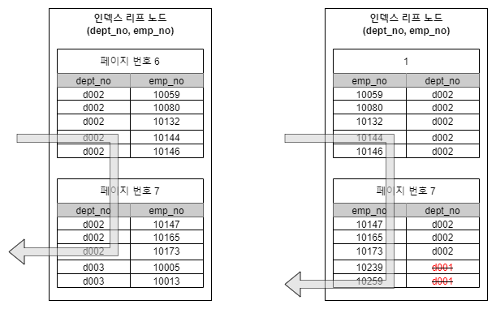

# 인덱스의 가용성과 효율성

### 비교 조건의 종류와 효율성

<mark style="background-color:blue;">다중 칼럼 인덱스에서 각 칼럼의 순서와 그 칼럼에 사용된 조건이 동등 비교("=")인지 아니면 크다(">") 또는 작다("<") 같은 범위 조건인지에 따라 각 인덱스 칼럼의 활용 형태가 달라진다.</mark>

```sql
SELECT * FROM dept_emp WHERE dept_no='d002' AND emp_no >= 10114;
```

위 쿼리를 처리하기 위해 다음과 같은 칼럼의 순서만 다른 인덱스를 생성했다고 가정하고 각각 어떠한 차이가 있는지 살펴보자.

```sql
1. INDEX(dept_no, emp_no)
2. INDEX(emp_no, dept_no)
```

케이스 1번의 인덱스는 "dept\_no='d002' AND emp\_no >= 10444" 인 레코드를 찾고 그 이후에 dept\_no가 'd002'가 아닐 때까지 인덱스를 쭉 읽기만 하면 되기 때문에 매우 효율적이다. 하지만 케이스 2번의 인덱스는 우선 "emp\_no >= 10444 AND dept\_no='d002'"인 레코드를 찾고, 이 그 이후 모든 레코드에 대해 dept\_no가 'd002' 인지 비교하는 과정을 거쳐야 한다. \
\
아래 그림을 보면 5개의 레코드를 가져오기 위해서 1번 인덱스는 5번의 비교만 발생했고, 2번 인덱스는 7번의 비교가 발생했다. 이와 같은 현상이 발생하는 이유는 다중 컬럼 인덱스의 정렬 방식 때문이다. <mark style="background-color:blue;">인덱스 1번의 2번째 컬럼은 작업 범위를 좁히는데 도움을 주지만, 인덱스 2번의 2번째 컬럼은 작업 범위를 좁히는데 사용되지 않고 값을 비교하는 필터링 용도로 사용되기 때문에 성능 차이가 발생하는 것이다.</mark>

<div align="left">

<figure><figcaption></figcaption></figure>

</div>

### 인덱스의 가용성

<mark style="background-color:blue;">B-Tree 인덱스의 특징은 왼쪽 값에 기준해서 오른쪽 값이 정렬돼 있다는 것이다.</mark> 여기서 왼쪽이란 하나의 칼럼 내에서 뿐만 아니라 다중 칼럼 인덱스의 칼럼에 대해서도 함께 적용된다. 이러한 정렬 방식은 인덱스 검색의 전제 조건이다.

* 케이스 A: INDEX(first\_name)
* 케이스 B: INDEX(dept\_no, emp\_no)

케이스 A의 인덱스가 지정된 employees 테이블에 대해 다음과 같은 쿼리가 어떻게 실행되는지 살펴보자.&#x20;

<div align="left">

<figure><figcaption></figcaption></figure>

</div>

```sql
SELECT * FROM employees WHERE first_name LIKE '%mer';
```

<mark style="background-color:blue;">이 쿼리는 인덱스 레인지 스캔 방식으로 인덱스를 이용할 수 없다.</mark> 그 이유는 first\_name 칼럼에 저장된 값의 왼쪽부터 한 글자씩 비교해 가면서 일치하는 레코드를 찾아야 하는데, 조건절에 주어진 상숫값 ('%mer') 에는 왼쪽 부분이 고정되어 있지 않기 때문이다.\
\
케이스 B의 인덱스가 지정된 dept\_emp 테이블에 대해 다음 쿼리가 어떻게 실행되는지 한번 살펴보자.

```sql
SELECT * FROM dept_emp WHERE emp_no >= 10144;
```

<mark style="background-color:blue;">인덱스가 (dept\_no, emp\_no) 칼럼 순서대로 생성돼 있다면 인덱스의 선행 칼럼인 dept\_no 조건 없이 emp\_no 값으로만 검색하면 인덱스를 효율적으로 사용할 수 없다</mark>. 케이스 B의 인덱스는 다중 칼럼으로 구성된 인덱스이므로 dept\_no 칼럼에 대해 먼저 정렬한 후, 다시 emp\_no 칼럼 값으로 정렬돼 있기 때문이다.
