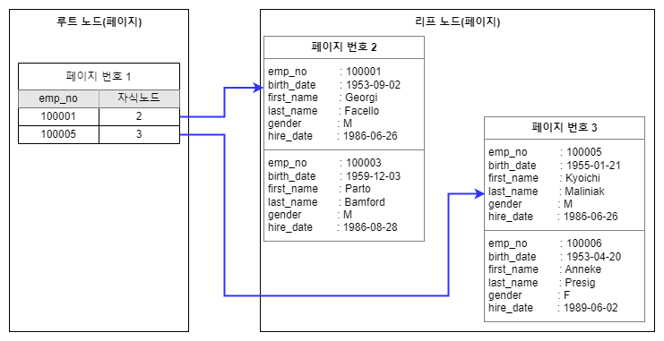

# 클러스터링 인덱스

### 클러스터링 인덱스

클러스터링 인덱스는 테이블의 프라이머리 키에 대해서만 적용되는 내용이다. <mark style="background-color:blue;">즉 프라이머리 키 값이 비슷한 레코드끼리 묶어서 저장하는 것을 클러스터링 인덱스라고 한다</mark>. <mark style="background-color:blue;">프라이머리 키 값에 의해 저장 위치가 결정되고 만약 프라이머리 키 값이 변경되면 레코드의 물리적인 저장 위치가 바뀌어야 한다는 것을 의미한다.</mark>&#x20;

<figure><figcaption><p>클러스터링 인덱스</p></figcaption></figure>

클러스터링 인덱스 구조를 보면 클러스터링 테이블의 구조 자체는 일반 B-Tree와 비슷하지만 세컨더리 인덱스를 위한 B-Tree 의 리프 노드와는 달리 클러스터링 인덱스의 리프 노드에는 레코드의 모든 칼럼이 같이 저장돼 있음을 알 수 있다.&#x20;


#### 프라이머리 키 선택 순서

프라이머리 키가 없는 InnoDB 테이블은 어떻게 클러스터링 테이블로 구성될까? 프라이머리 키가 없는 경우에는 InnoDB 스토리지 엔진이 다음 우선순위대로 프라이머리 키를 대체할 칼럼을 선택한다.

1. 프라이머리 키가 있으면 기본적으로 프라이머리 키를 클러스터링 키로 선택
2. NOT NULL 옵션의 유니크 인덱스 중에서 첫 번째 인덱스를 클러스터링 키로 선택
3. 자동으로 유니크한 값을 가지도록 증가되는 칼럼을 내부적으로 추가한 후 클러스터링 키로 선택


### 세컨더리 인덱스에 미치는 영향

MyISAM 이나 MEMORY 테이블 같은 클러스터링 되지 않은 테이블은 INSERT 될 때 처음 저장된 공간에서 절대 이동하지 않는다. 하지만 <mark style="background-color:blue;">InnoDB 테이블은  클러스터링키값이 변경되면 실제 데이터 레코드의 위치가 변경된다.</mark>\
\
<mark style="background-color:blue;">그렇다면 InnoDB 테이블에서 세컨더리 인덱스가 실제 레코드가 저장된 주소를 가지고 있으면 어떻게 될까? 클러스터링 키 값이 변경될 때마다 데이터 레코드의 주소가 변경되고 그떄마다 해당 테이블의 모든 인덱스에 저장된 주솟값을 변경해야 할 것이다.</mark> 이런 오버헤드를 제거하기 위해 InnoDB 테이블의 모든 세컨더리 인덱스는 레코드가 저장된 주소가 아니라 프라이머리 키 값을 저장하도록 구현돼있다.

```sql
// first_name 칼럼으로 인덱스 생성
SELECT * FROM employees WHERE first_name='Aamer';
```

각 엔진에서 위의 쿼리를 실행하는 순서는 다음과 같다

* MyISAM: first\_name 인덱스를 검색해서 레코드의 주소를 확인한 후, 레코드의 주소를 이용해 최종 레코드를 가져옴
* InnoDB: first\_name 인덱스를 검색해서 레코드의 프라이머리 키 값을 확인한 후 프라이머리 키 인덱스를 검색해서 최종 인덱스를 가져옴


### 클러스터링 인덱스의 장점과 단점

#### 장점

1. <mark style="background-color:blue;">프라이머리 키로 검색할 때 처리 성능이 매우 빠르다</mark>
2. 테이블의 모든 세컨더리 인덱스가 프라이머리 키를 가지고 있기 때문에 인덱스만으로 처리될 수 있는 경우가 많다. (= 커버링 인덱스)

#### 단점

1. 테이블의 모든 세컨더리 인덱스가 클러스터링 키를 갖기 때문에 클러스터링 키 값의 크기가 클 경우 전체적으로 인덱스의 크기가 커진다.
2. 세컨더리 인덱스를 통해 검색할 때 프라이머리 키로 다시 한번 검색해야 하므로 처리 성능이 낮다.
3. <mark style="background-color:blue;">INSERT 를 할 때 프라이머리 키에 의해 레코드의 저장 위치가 결정되기 때문에 처리 성능이 낮다.</mark>
4. <mark style="background-color:blue;">프라이머리 키를 변경할 때 레코드를 DELETE 하고 INSERT 작업이 필요하기 때문에 처리 성능이 느리다.</mark>


### 클러스터링 테이블 사용 시 주의 사항

#### 1. 클러스터링 인덱스 키의 크기

클러스터링 테이블의 경우 모든 세컨더리 인덱스가 프라이머리 키 값을 포함한다. 그래서 프라이머리 키의 크기가 커지면 세컨더리 인덱스도 자동으로 크기가 커진다. 일반적으로 하나의 테이블에 세컨더리 테이블이 4\~5개가 생성되기 때문에 저장되는 레코드의 수가 많아질수록 인덱스 크기가 커지기 때문에 주의가 필요하다.

#### 2. 프라이머리 키는 AUTO\_INCREMENT 보다는 업무적인 칼럼으로 생성

InnoDB의 프라이머리 키는 클러스터링 키로 사용되며, 이 값에 의해 레코드의 저장위치가 결정된다. 때문에 프라이머리 키로 검색하는 경우 클러스터링 되지 않은 테이블에 비해 매우 빠르게 처리될 수 있다. 때문에 검색 성능을 극대화 하는 장점을 위해 업무적인 칼럼으로 프라이머리 키를 사용하는 것이 좋다.

