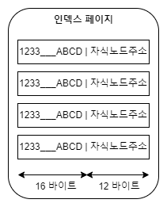

# 인덱스 사용에 영향을 미치는 요소

### 인덱스 키 값의 크기

<mark style="background-color:blue;">InnoDB 스토리지 엔진은 디스크에 데이터를 저장하는 가장 기본 단위를 페이지라고 하며 디스크의 모든 읽기 및 쓰기 작업의 최소 작업 단위가 된다</mark>. 또한 페이지는 InnoDB 스토리지 엔진의 버퍼 풀에서 데이터를 버퍼링하는 기본 단위이기도 하다.\
\
<mark style="background-color:blue;">때문에 인덱스 검색 성능은 하나의 페이지에서 저장할 수 있는 자식 노드의 개수에 대해 영향을 받는다.</mark> 인덱스 페이지의 기본  값은 기본적으로 16KB 이다.&#x20;

<div align="left">

<figure><figcaption></figcaption></figure>

</div>

인덱스 키가 16 바이트라고 가정하고 자식 노드의 주소 영역이 12 바이트라고 가정하면 1개의 페이지에서 저장할 수 있는 키 값은 585개이다.&#x20;

$$
16 * 1024 / (16 + 12) = 585
$$

만약 인덱스 키 값이 커지면 어떻게 될까? 위의 경우에서 키 값이 크기가 두 배인 32바이트로 늘어났다고 가정하면 1개의 페이지에서 저장할 수 있는 키 값은 372개가 된다.

$$
16 * 1024 / (32+12) = 372
$$

즉 SELECT 쿼리가 레코드 500개를 읽어야 한다면 전자는 인덱스 페이지 한번으로 해결될 수 있지만, 후자는 최소한 2번 이상 디스크로부터 읽어야 한다는 것이다. <mark style="background-color:blue;">결국 인덱스를 구성하는 키 값의 크기가 커지면 디스크로부터 읽어야 하는 횟수가 늘어나고 그만큼 느려진다는 것을 의미한다.</mark>


### 선택도(기수성)

<mark style="background-color:blue;">인덱스에서 선택도는 모든 인덱스 키 값 가운데 유니크한 값의 수를 의미한다.</mark> 전체 인덱스 키 값은 100개인데, 그중에서 유니크한 값의 수는 10개라면 기수성은 10이다. <mark style="background-color:blue;">인덱스는 선택도가 높을수록 검색 대상이 줄어들기 때문에 그만큼 빠르게 처리할 수 있다.</mark>\
\
country 라는 칼럼과 city라는 칼럼이 포함된 tb\_test 테이블을 살펴보자. tb\_test 테이블의 전체 레코드 건수는 1만 건이며, country 칼럼으로만 인덱스가 생성된 상태에서 아래의 두 케이스를 살펴보자.

* 케이스 A: country 칼럼의 유니크한 값의 개수가 10개
* 케이스 B: count 칼럼의 유니한 값의 개수가 1,000개

```sql
SELECT * FROM tb_test WHERE country='KOREA' AND city='SEOUL'
```

위의 쿼리를 실행하면 A 케이스의 경우에는 평균 1,000건, B 케이스의 경우에는 평균 10건이 조회될 수 있다는 것을 인덱스의 통계 정보로 예측할 수 있다. 실제 모든 조건을 만족하는 레코드는 단 1건만 있었다면 A케이스의 인덱스는 비효율적인 것을 알 수 있다. (1건을 조회하기 위해 999건의 추가 조회가 발생함)


### 읽어야 하는 레코드의 건수

<mark style="background-color:blue;">인덱스를 통해 테이블의 레코드를 읽는 것은 인덱스를 거치지 않고 바로 테이블의 레코드를 읽는 것보다 4\~5배높은 비용이 드는 작업이다.</mark>  따라서 인덱스를 통해 읽어야 할 레코드의 건수가 전체 테이블 레코드의 20\~25%를 넘어서면 인덱스를 이용하지 않고 테이블을 모두 직접 읽어서 필요한 레코드만 가려내는 방식으로 처리하는 것이 효율적일 것이다.
